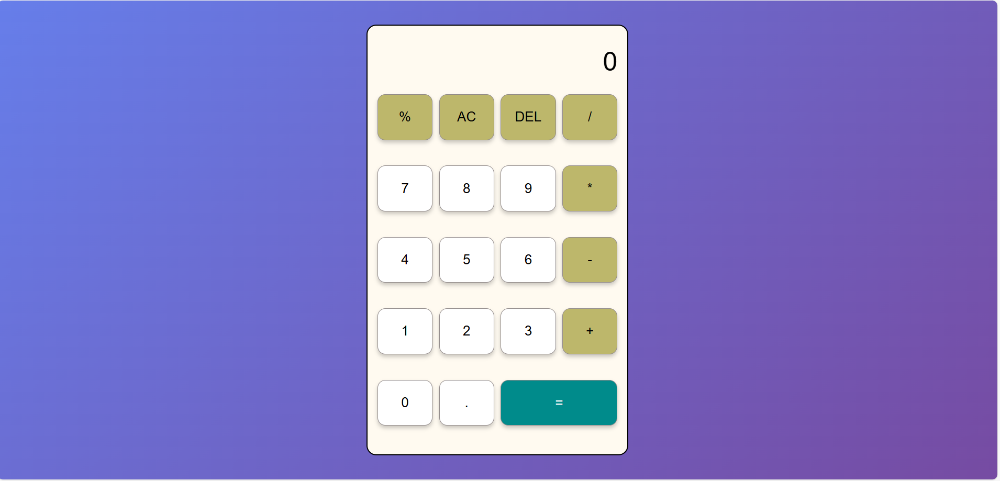

# 🧮 Responsive Calculator

A simple and fully responsive calculator built using **HTML, CSS, and JavaScript**.  
This calculator works smoothly on desktop, tablet, and mobile devices.

---

## 🚀 Live Demo

You can host it using GitHub Pages.

---

## 📌 Features

- ✅ Fully Responsive Design
- ✅ Clean and Modern UI
- ✅ Mobile Friendly
- ✅ Basic Arithmetic Operations (+, -, ×, ÷)
- ✅ Clear (C) and Delete (DEL) Buttons
- ✅ Button Click Animation Effect

---

## 🛠️ Technologies Used

- HTML5
- CSS3 (Flexbox + Grid)
- JavaScript (DOM Manipulation)

---


---

## 📸 Screenshot




---

## ⚙️ How to Use

1. Clone the repository:
   ```bash
   git clone https://github.com/code-aadi/Calculator.git
   ```

2. Open the project folder.

3. Run `index.html` in your browser.

---

## 📱 Responsive Design

The calculator adjusts automatically based on screen size:

- Desktop 💻
- Tablet 📱
- Mobile 📲

---

## 🔮 Future Improvements

- Dark / Light Mode Toggle
- Keyboard Support
- Scientific Calculator Version
- Calculation History

---

## 🤝 Contributing

Feel free to fork this repository and improve it.  
Pull requests are welcome!

---

## 📜 License

This project is open source and free to use.

---

## 👨‍💻 Author

Aditya Kourav 
GitHub: https://github.com/code-aadi

---

⭐ If you like this project, don't forget to star the repository!